# Porosity Modeling

This framework models porosity in L-PBF metal parts, simulating lack-of-fusion, keyhole, and gas porosity mechanisms. It integrates experimental X-µCT data for realistic pore distributions and offers both CLI and GUI interfaces. Designed for researchers and engineers, the modular system allows swapping between data-driven and physics-based models to study process parameters and pore formation.


Go to [IMQCAM.org](https://data.imqcam.org/#)

```{figure} images/imqcam.png
---
name: imqcam_portal
---
```

> If you are new to portal click here to follow the registration process:
> <https://docs.imqcam.org/docs/users_guide/sign_in.html>

## Accessing Tale Dashboard

Go to tale dashboard

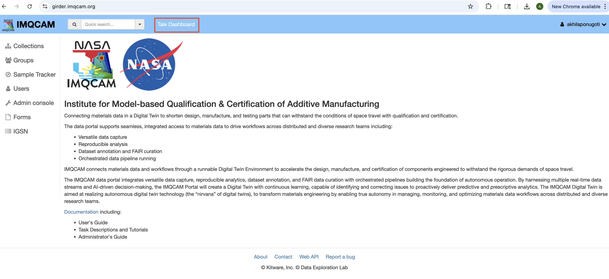

## Finding the Porosity Model

Once you open this click on **Share with me** and look for the tale named **"Porosity Model"** by Kacper Kowalik.

> **Important:** To access this tale in "Share with me," you need to request access from the author first.

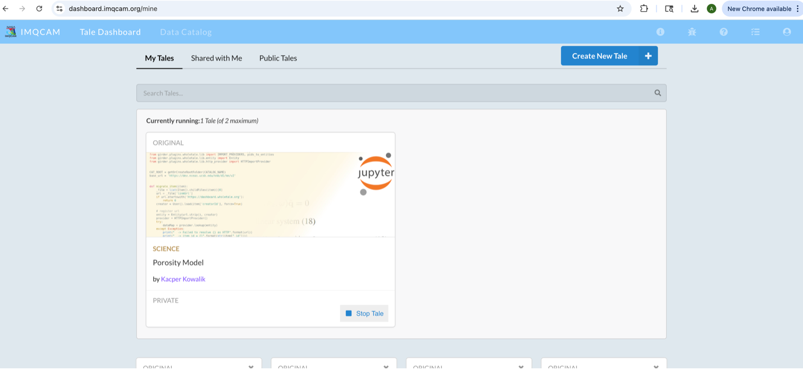

## Running the Tale

Click on that you will see a window like this:

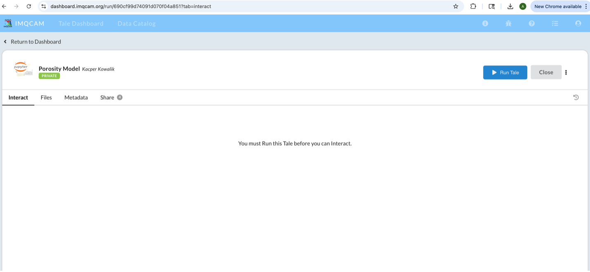

Click on **Run tale**

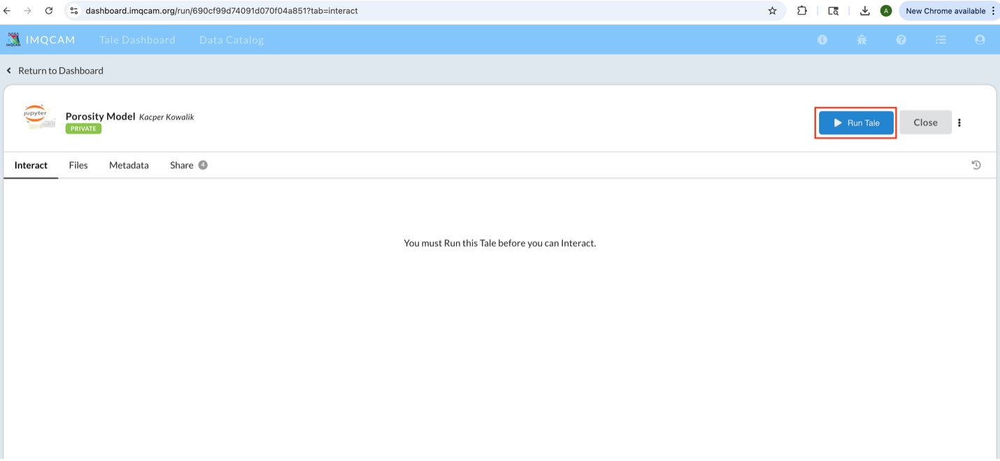

**Note:** This will take some time to start the tale (approximately 3-5 minutes). If it's taking too long, just refresh the webpage.

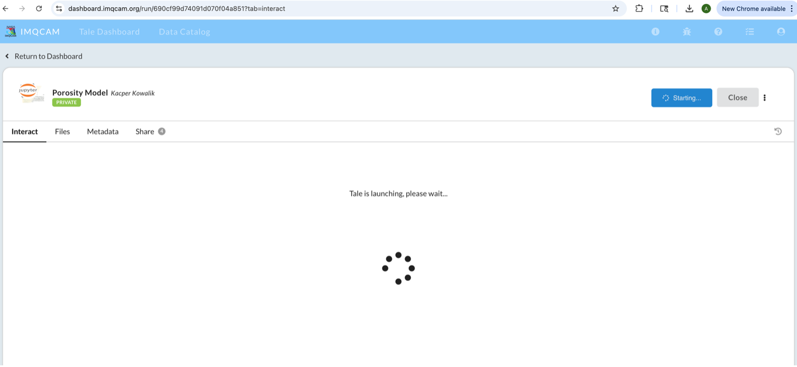

## Using the GUI

Once the tale starts you will be able to see the GUI.

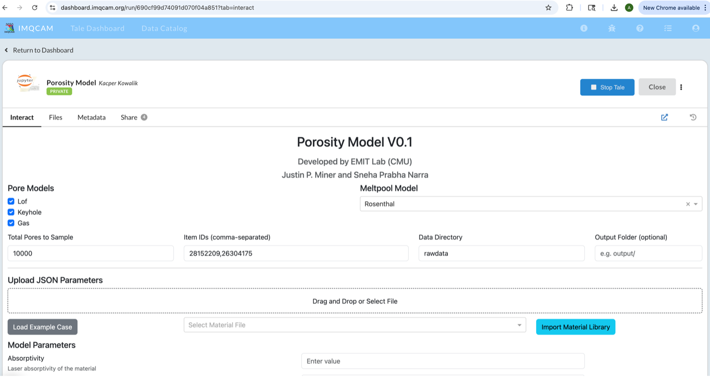

The user can now use and run the GUI by passing the local files and parameters.

You can use example data by:
1. Clicking on **Load Example Case**
2. Using the drop down for **Import Material Library**

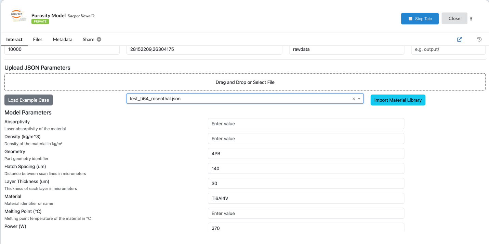

## Running the Model

After giving all the parameters you can now click on **Run Model**

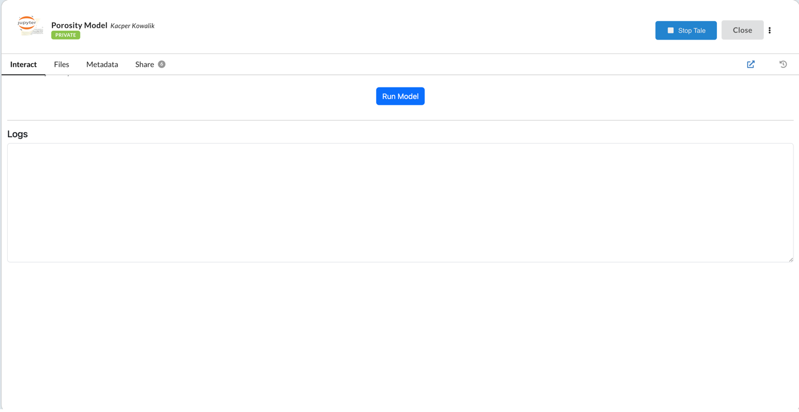

## Viewing Results

It will run and show the plot like below:

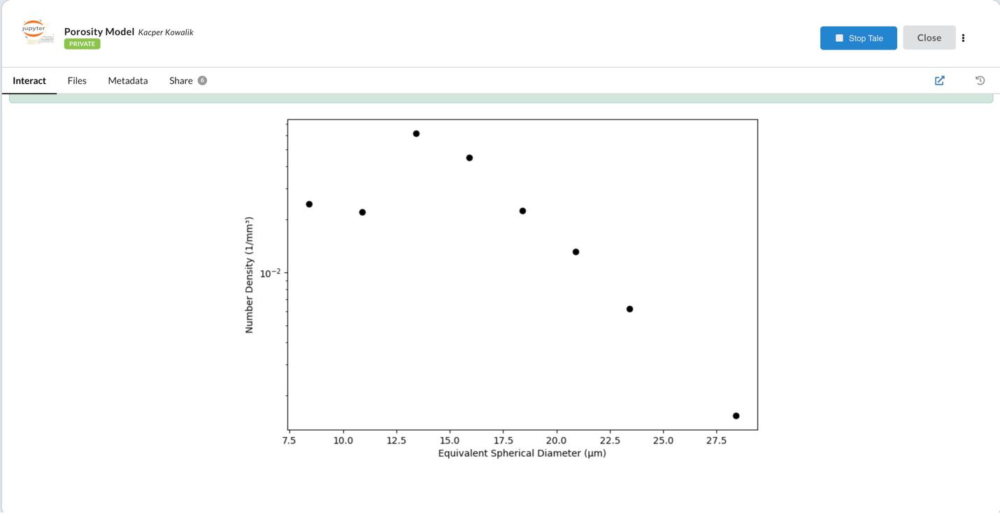

## Accessing Output Files

You can find the results in **Files tab** → **Tale Workspace** in the **output** folder. It will save the output for every run.

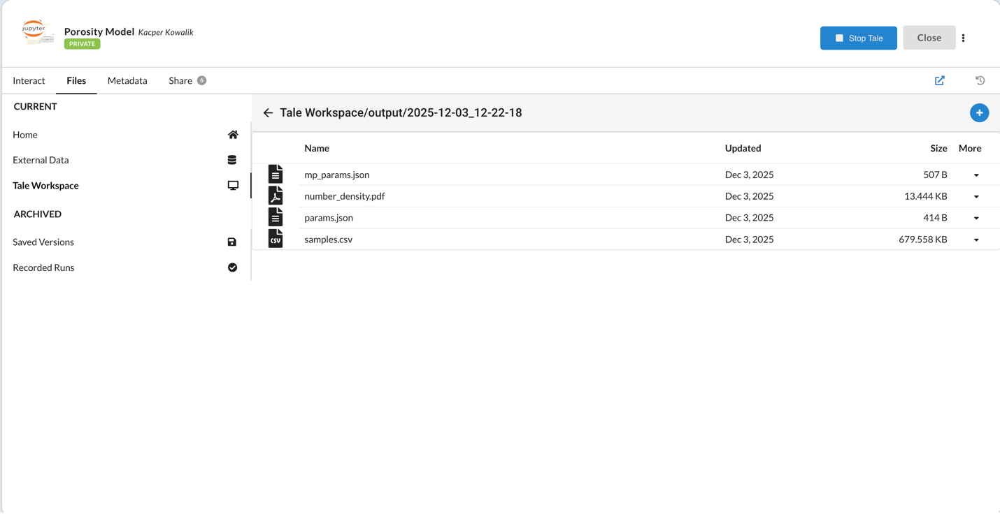

## Uploading Your Own Data

If you want to upload your own data for the run, go to:
**Files tab** → **External data** and upload from the IMQCAM portal.

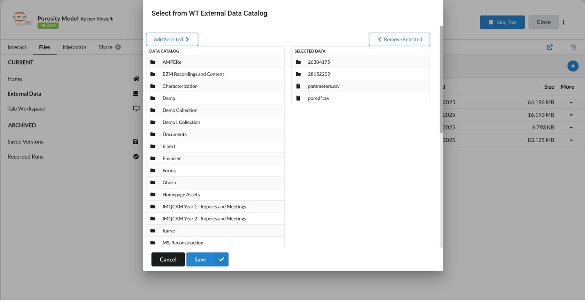
